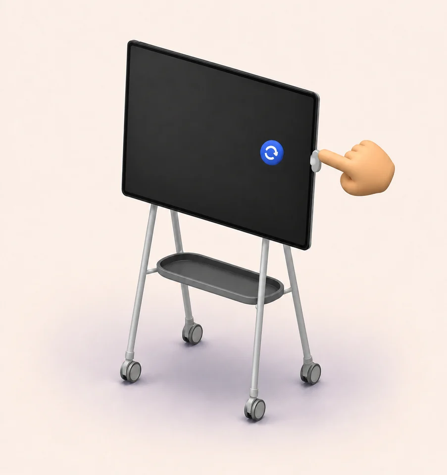

# Swivel

<p align="center">
  
</p>

[Website](https://jelizarovas.github.io/swivel/) · [Download the latest Windows build](https://github.com/jelizarovas/swivel/releases/latest/download/Swivel.exe) · [Releases](https://github.com/jelizarovas/swivel/releases)

Swivel is a small Windows utility for rotating a Surface Hub 2S from a bubble beside its fingerprint reader.

> [!CAUTION]
> Swivel is an unsigned, early prototype. Windows SmartScreen may warn, managed-device policy may block it, and real Surface Hub behavior still needs to be verified on the target hardware.

## Why

The physical stand rotates. The Windows desktop does not get the memo. Swivel reduces the usual Display Settings ceremony to one reader touch and one large rotation button.

Swivel rotates the Windows desktop; it does **not** motorize the physical stand. You still provide the heroic manual swivel.

## Behavior

- One unused fingerprint scan toggles the rotation bubble.
- The round blue bubble closes automatically after two seconds by default; its outer ring shows elapsed time.
- Pressing the bubble pauses dismissal while the pointer or finger is held down.
- Holding the blue bubble for two seconds reveals the Settings shortcut. Windows does not expose fingerprint-reader hold duration, so the reader itself remains a single-touch trigger.
- A second fingerprint scan closes an open bubble.
- The default landscape position is right-center.
- The default portrait position is bottom-center.
- The Swivel button safely tests the requested display mode before applying it.
- Touch-friendly chips change both positions and which physical edge moves down.
- When more than one display is connected, Monitor chips choose which display Swivel rotates and where its bubble appears.
- One left-click on the tray icon rotates the selected display. Right-click opens the tray menu.
- Settings save automatically; there is no separate Save button.
- A **Test bubble** button makes the full bubble flow testable on a computer without a reader.

## First Surface Hub test

The Hub must run Windows 10/11 Pro or Enterprise. The Surface Hub Fingerprint Reader is not supported on Windows 10 Team.

1. [Download the compact `Swivel.exe`](https://github.com/jelizarovas/swivel/releases/latest/download/Swivel.exe) into a permanent local folder on the Hub, such as `Documents\Swivel`.
2. Double-click it. The compact build is about 317 KB and uses the Microsoft .NET 8 Desktop Runtime. If that runtime is missing, Windows displays the required framework and an official download link; install it, then open Swivel again.
3. If you prefer a larger file that carries its own runtime, download [`Swivel-standalone.exe`](https://github.com/jelizarovas/swivel/releases/latest/download/Swivel-standalone.exe) instead.
4. Confirm that the **Fingerprint reader** card says Swivel is listening.
5. Touch the reader once and confirm the bubble appears.
6. Use **Test bubble** if the reader is not available yet.
7. Press the blue **Swivel** button only when ready to test the Hub's real display orientation.
8. The Hub stand normally uses **Right side down**. If your mount turns the other way, choose **Left side down**.
9. Enable **Launch Swivel automatically when I sign in** only after the reader, rotation, lock/unlock, and sleep/resume checks pass.

The executable is currently unsigned, so Windows SmartScreen may show an unknown-publisher warning.

## Privacy and Windows Hello

Swivel listens only for Windows' `WINBIO_EVENT_FP_UNCLAIMED` notification. It does not request fingerprint identification, receive a fingerprint image, or store biometric data. It unregisters the listener while Windows is locked or sleeping and reconnects after unlock/resume.

Some fingerprint drivers, including some Enhanced Sign-in Security configurations, do not expose background scan notifications. Swivel reports that condition in the control panel and keeps the simulated trigger available.

## Diagnostics

Settings are stored under:

`%LOCALAPPDATA%\Swivel\settings.json`

Runtime diagnostics are stored under:

`%LOCALAPPDATA%\Swivel\swivel.log`

Logs stay local, but their diagnostic header can contain the expanded Windows profile path. Redact local paths before posting a log publicly.

## Build

Development build:

```powershell
dotnet build .\Swivel.csproj -c Release
```

Compact Windows x64 release (requires .NET 8 Desktop Runtime):

```powershell
dotnet publish .\Swivel.csproj -p:PublishProfile=Compact
```

Standalone Windows x64 release:

```powershell
dotnet publish .\Swivel.csproj -p:PublishProfile=Portable
```

Both profiles produce single-file executables. `Compact` is about 317 KB and relies on the installed desktop runtime. `Portable` includes that runtime and is about 68 MiB.

## Website development

The landing page and interactive Three.js demo are a React, Vite, and Tailwind CSS project in `docs`.

```powershell
cd .\docs
npm install
npm run dev
```

Run `npm run check` and `npm run build` before committing. Changes under `docs` deploy to GitHub Pages automatically after they reach `main`.

## Current verification boundary

- Confirmed locally: clean Release compilation, settings round-trip, display-mode inspection, placement calculations, simulated bubble rendering, tray startup, fingerprint-reader absence handling, and graceful shutdown.
- Surface Hub testing found the original right-side-down mapping was reversed; v0.1.2 corrected it. The corrected mapping still needs a device re-test.
- Not yet confirmed: the Surface Hub reader's unclaimed-event support, corrected live rotation direction, Hub DPI placement, lock/unlock behavior, sleep/resume behavior, and launch-at-sign-in on the Hub.

## Source license

The source is publicly visible for inspection, but no open-source license has been selected yet. All rights remain with the copyright holder unless a license is added later.
