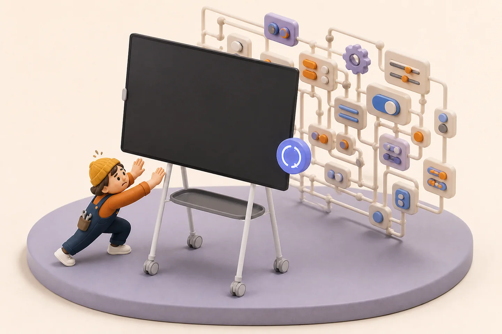

# Swivel

<p align="center">
  
</p>

[Website](https://jelizarovas.github.io/swivel/) · [Download the latest Windows build](https://github.com/jelizarovas/swivel/releases/latest/download/Swivel.exe) · [Releases](https://github.com/jelizarovas/swivel/releases)

Swivel is a small Windows utility for rotating a Surface Hub 2S from a bubble beside its fingerprint reader.

> [!CAUTION]
> Swivel is an unsigned, early prototype. Windows SmartScreen may warn, managed-device policy may block it, and real Surface Hub behavior still needs to be verified on the target hardware.

## Why

The physical stand rotates. The Windows desktop does not get the memo. Swivel reduces the usual Display Settings ceremony to one reader touch and one large rotation button.

Swivel rotates the Windows desktop; it does **not** motorize the physical stand. You still provide the heroic manual swivel.

## Prototype behavior

- One unused fingerprint scan toggles the rotation bubble.
- The bubble closes automatically after two seconds by default.
- Touching or hovering over the bubble pauses the countdown.
- A second fingerprint scan closes an open bubble.
- The default landscape position is right-center.
- The default portrait position is bottom-center.
- The Rotate button safely tests the requested display mode before applying it.
- Settings can change the timeout, both positions, portrait direction, Settings-button visibility, and launch-at-sign-in behavior.
- A **Simulate fingerprint touch** button makes the full bubble flow testable on a computer without a reader.

## First Surface Hub test

The Hub must run Windows 10/11 Pro or Enterprise. The Surface Hub Fingerprint Reader is not supported on Windows 10 Team.

1. [Download `Swivel.exe`](https://github.com/jelizarovas/swivel/releases/latest/download/Swivel.exe) into a permanent local folder on the Hub, such as `Documents\Swivel`.
2. Double-click the executable. It does not need a separate .NET installation.
3. Confirm that the **Fingerprint reader** card says Swivel is listening.
4. Touch the reader once and confirm the bubble appears.
5. Use **Simulate fingerprint touch** if the reader is not available yet.
6. Press **Rotate display** only when ready to test the Hub's real display orientation.
7. If portrait turns the wrong way, change **How the panel turns into portrait**.
8. Enable **Launch Swivel automatically when I sign in** only after the reader, rotation, lock/unlock, and sleep/resume checks pass.

The executable is currently unsigned, so Windows SmartScreen may show an unknown-publisher warning.

## Privacy and Windows Hello

Swivel listens only for Windows' `WINBIO_EVENT_FP_UNCLAIMED` notification. It does not request fingerprint identification, receive a fingerprint image, or store biometric data. It unregisters the listener while Windows is locked or sleeping and reconnects after unlock/resume.

Some fingerprint drivers, including some Enhanced Sign-in Security configurations, do not expose background scan notifications. Swivel reports that condition in the control panel and keeps the simulated trigger available.

## Diagnostics

Settings are stored under:

`%LOCALAPPDATA%\Swivel\settings.json`

Runtime diagnostics are stored under:

`%LOCALAPPDATA%\Swivel\swivel.log`

Logs stay local, but their diagnostic header can contain the expanded Windows profile path. Redact local paths before posting a log publicly.

## Build

Development build:

```powershell
dotnet build .\Swivel.csproj -c Release
```

Portable Windows x64 release:

```powershell
dotnet publish .\Swivel.csproj -p:PublishProfile=Portable
```

The publish profile produces a self-contained, single-file executable under `artifacts\Swivel-win-x64`.

## Current verification boundary

- Confirmed locally: clean Release compilation, settings round-trip, display-mode inspection, placement calculations, simulated bubble rendering, tray startup, fingerprint-reader absence handling, and graceful shutdown.
- Not yet confirmed: the Surface Hub reader's unclaimed-event support, live Hub rotation direction, Hub DPI placement, lock/unlock behavior, sleep/resume behavior, and launch-at-sign-in on the Hub.

## Source license

The source is publicly visible for inspection, but no open-source license has been selected yet. All rights remain with the copyright holder unless a license is added later.
